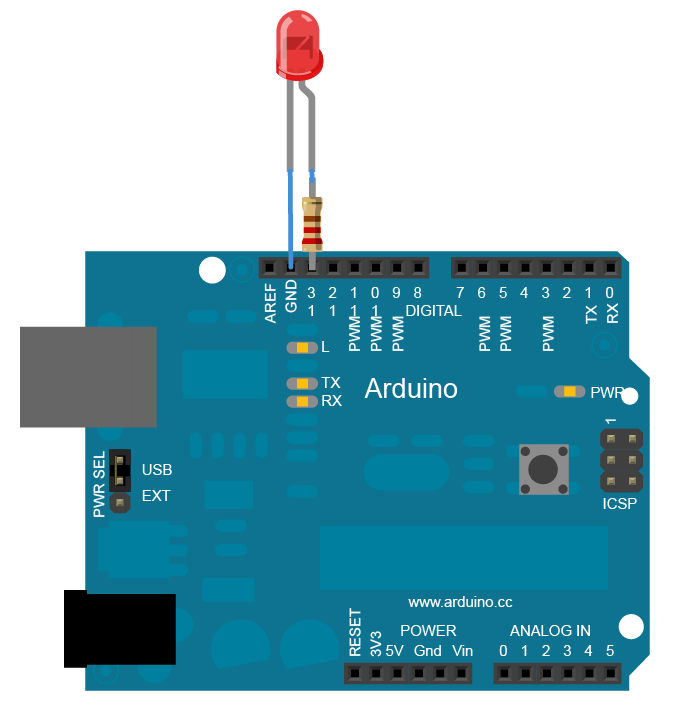

# Circuit Python
My CircuitPython assignments:

## Table of Contents
* [Table of Contents](#Table-of-Contents)
* [LED Fade](#LED-Fade)
* [Servo Capacitative Touch](#Servo-Capacitative-Touch)
* [CircuitPython LCD](#CircuitPython-LCD)
* [CircuitPython LCD](#CircuitPython-LCD)
* [Photo Interrupter](#Photo-Interrupter)
* [Distance Sensor](#Distance-Sensor)
* [RGB LED](#RGB-LED)
* [Hello vs Code](#Hello-vs-Code)
* [Fancy LED](#Fancy-LED)

## LED Fade

[LED Fade Code](https://github.com/gventre04/CircuitPython/blob/master/fading_led.py)

### Objective

This assignment required us to initially learn to manipulate the on board RGB LED and to make the LED blink. Once we had figured out how to make the LED blink we had to make code for an LED so that it would fade in and out gradually. 

### Lesson(s) Learned

This assignment served as our introduction into the new language of CircuitPython and a new board called a Metro MO Express. This coding langauge requres many different imports such as math, time, board, digitalio, neopixel to name a few. This specific assignment I learned how to use the import pulseio which is required to make the LED fade as well as manipulating the duty cycle. 

### Wiring Diagram 

 

## Servo Capacitative Touch

[Servo Capacitative Touch Code](https://github.com/gventre04/CircuitPython/blob/master/servo.py)

### Objective

This code uses two wires inserted into Analog pins to control the direction of a servo, touching one spins it clockwise, and the other spins it counterclockwise. The servo would only move when the wires were touched. 

### Lesson(s) Learned

The concept of capacitative touch was completely new to me so I had to rely on google and Mr. H for guidance. We also were required to download our first module, adafruit motor, onto the Metro. I initially had trouble getting the movement of the servo to be slight rather than a complete 180 degree turn per touch, but after using if statements I managed to regulate the movement of the servo. 

### Wiring Diagram  

 

## CircuitPython LCD 

[CircuitPython LCD Code](https://github.com/gventre04/CircuitPython/blob/master/lcd_button.py)

### Objective

This code uses a button and an lcd screen, and a switch, when pushing the button, a counter on the lcd screen increase by +1. Flipping the switch will decrease the counter on the screen by -1.

### Lesson(s) Learned

I had a problem with the button being held causing the button counter on the LCD to continuosly counting up or down. I had to add oldButtonState to make sure each press counted for a single +1 on the LCD. 

### Wiring Diagram 

 

## Photo Interrupter

[Photo Interrupter Code](https://github.com/gventre04/CircuitPython/blob/master/photointerrupter.py)

### Objective

This code counts the amount of time the photointerrupter has been interrupted within a given interval, posting that number on the serial monitor every 4 seconds.

### Lesson(s) Learned

The challenging part about this assignment was the time interval and including the amount of interrupts in that given interval. I solved with with photo and state to count the interrupts and start = time.time() to calculate the 4 second interval.

### Wiring Diagram  

 

## Distance Sensor

[Distance Sensor Code](https://github.com/gventre04/CircuitPython/blob/master/DistanceSensor.py)

### Objective

This assignment had us wire an HCSR-04 sensor and use it as a distance sensor that changes the color of the neopixel on the Metro based on how far an object is from the sensor. 

### Lesson(s) Learned

The challenge with this assignment was mapping out the parameters for the colors based on distance, initially I coded the sensor to give out three different colors for 5cm, 20cm, and 35cm. I had to add a fade effect from one color to the next as distance increased or decreased. 

### Image 

 

## RGB LED

[RGB LED Code](https://github.com/gventre04/CircuitPython/blob/master/rgb.py)

### Objective

Classes, objects, and modules code, triggering rgb anode leds.

### Lesson(s) Learned

### Wiring Diagram  

 

## Hello vs Code

[Hello vs Code Code](https://github.com/gventre04/CircuitPython/blob/master/hello_vs_code.py)

### Objective

### Lesson(s) Learned

## Fancy LED

[Fancy LED Code](https://github.com/gventre04/CircuitPython/blob/master/fancyLED.py)

### Objective

### Lesson(s) Learned

### Wiring Diagram 

 
